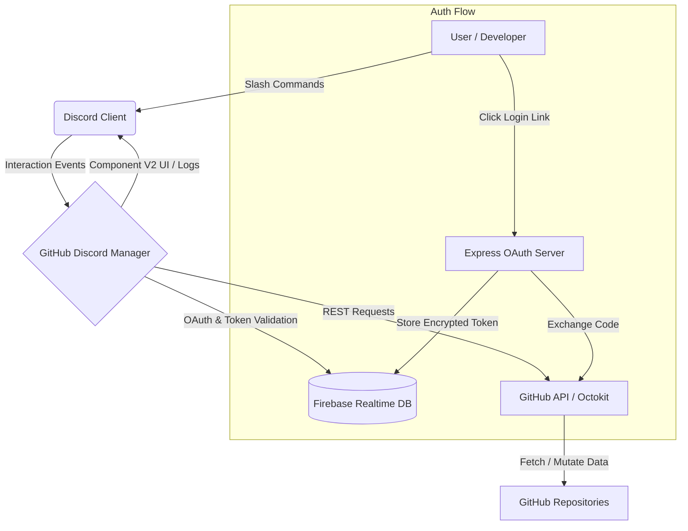

<div align="center">
  
  
  
  <h1>GitHub Discord Manager</h1>
  <p>A production-grade Discord bot that lets developers manage GitHub repositories entirely through Discord Component V2 slash commands — optimized for mobile and desktop.</p>

  <p>
    
    
    
    
    
    
  </p>
</div>

<br />

## Architecture Overview



## Features

| Category | Commands |
|---|---|
| **Auth** | `/github login`, `/github logout`, `/github whoami`, `/github stats` |
| **Repos** | `/repo create/delete/list/info/rename/fork/visibility/topics/star/unstar` |
| **Files** | `/file read/create/edit/delete` |
| **Branches** | `/branch list/create/delete/protect` |
| **Pull Requests** | `/pr create/list/merge/close/review` |
| **Issues** | `/issue create/list/close/assign/label` |
| **Collaborators** | `/collab add/remove/list` |
| **Releases** | `/release create/list/delete` |
| **Setup** | `/setup` (Automatically provisions GitHub log channels) |

## Tech Stack

- **Runtime**: Node.js 20+
- **Discord**: discord.js v14.16.0+ (Component V2 support)
- **GitHub API**: @octokit/rest
- **Auth**: GitHub OAuth 2.0 (custom flow)
- **Database**: Firebase Realtime Database
- **HTTP**: Express.js (OAuth callback server)

## Prerequisites

- Node.js 20 or later
- A Discord application (Bot)
- A GitHub OAuth App
- A Firebase project with Realtime Database enabled

## Setup Guide

### Step 1: Create a Discord Application

1. Go to [discord.com/developers/applications](https://discord.com/developers/applications)
2. Click **New Application** and provide a name
3. Navigate to **Bot** and click **Add Bot**
4. Under **Token**, click **Reset Token** and copy it; this is your `DISCORD_TOKEN`
5. Copy the **Application ID** from the **General Information** tab; this is your `DISCORD_CLIENT_ID`
6. Invite the bot to your server:
   ```text
   https://discord.com/api/oauth2/authorize?client_id=YOUR_CLIENT_ID&permissions=2147483648&scope=bot+applications.commands
   ```

### Step 2: Create a GitHub OAuth App

1. Go to [github.com/settings/developers](https://github.com/settings/developers)
2. Click **OAuth Apps** then **New OAuth App**
3. Fill in:
   - **Application name**: e.g., `GitHub Discord Manager`
   - **Homepage URL**: your deployment URL (or `http://localhost:3000` for development)
   - **Authorization callback URL**: `http://localhost:3000/callback` (development) or your production URL
4. Click **Register Application**
5. Copy the **Client ID**; this is your `GITHUB_CLIENT_ID`
6. Click **Generate a new client secret** and copy it; this is your `GITHUB_CLIENT_SECRET`

### Step 3: Set Up Firebase Realtime Database

1. Go to [console.firebase.google.com](https://console.firebase.google.com)
2. Click **Add project** and follow the prompts
3. From the left sidebar: **Build** then **Realtime Database** then **Create Database**
4. Copy the database URL; this is your `FIREBASE_DATABASE_URL`
5. Generate a service account key:
   - Go to **Project Settings** then **Service Accounts**
   - Click **Generate new private key** and download the JSON file
   - Minify the JSON file contents to a single line:
     ```bash
     node -e "const fs=require('fs'); console.log(JSON.stringify(JSON.parse(fs.readFileSync('your-key.json','utf8'))))"
     ```
   - Use this single-line JSON as the value for `FIREBASE_SERVICE_ACCOUNT_KEY`

### Step 4: Configure Environment Variables

```bash
cp .env.example .env
```

Edit `.env` and fill in all values:

```env
DISCORD_TOKEN=your_bot_token
DISCORD_CLIENT_ID=your_application_id
DISCORD_GUILD_ID=your_guild_id_for_dev

GITHUB_CLIENT_ID=your_github_oauth_client_id
GITHUB_CLIENT_SECRET=your_github_oauth_client_secret
GITHUB_REDIRECT_URI=http://localhost:3000/callback

# Generate with: node -e "console.log(require('crypto').randomBytes(32).toString('hex'))"
ENCRYPTION_KEY=a_64_char_hex_string

FIREBASE_DATABASE_URL=https://your-project-default-rtdb.firebaseio.com
FIREBASE_SERVICE_ACCOUNT_KEY={"type":"service_account","project_id":"..."}

PORT=3000
```

### Step 5: Install Dependencies

```bash
npm install
```

### Step 6: Register Slash Commands

```bash
npm run deploy-commands
```

### Step 7: Start the Bot

```bash
# Development (with auto-restart on changes)
npm run dev

# Production
npm start
```

## Security

- Tokens are **AES-256-CBC encrypted** at rest in Firebase
- OAuth state tokens are single-use and expire after 10 minutes
- Command responses containing sensitive data use `ephemeral: true` to remain visible only to the invoking user
- Ensure the `.env` file and Firebase service account keys are added to `.gitignore`

## Project Structure

```text
src/
├── index.js                  # Bot entry point and graceful shutdown
├── deploy-commands.js        # Slash command registration script
├── config.js                 # Centralized environment variable configuration
├── auth/
│   ├── oauthServer.js        # Express OAuth callback server
│   ├── tokenManager.js       # Firebase token CRUD and AES encryption
│   ├── githubOAuth.js        # OAuth URL builder and code exchanger
│   └── requireAuth.js        # Authentication middleware for commands
├── commands/
│   ├── github.js             # /github commands
│   ├── repos/                # /repo subcommands
│   ├── files/                # /file subcommands
│   ├── branches/             # /branch subcommands
│   ├── prs/                  # /pr subcommands
│   ├── issues/               # /issue subcommands
│   ├── collaborators/        # /collab subcommands
│   └── releases/             # /release subcommands
├── handlers/
│   ├── commandHandler.js     # Dynamic command loader
│   └── errorHandler.js       # Global Component V2 error mapper
└── utils/
    ├── components.js         # Discord Component V2 builders and factories
    ├── logger.js             # Automated cross-guild Firebase logging
    ├── pagination.js         # Component V2 paginated lists
    ├── validators.js         # Input sanitization
    └── rateLimiter.js        # GitHub API rate limit hook
```

## License

MIT License
